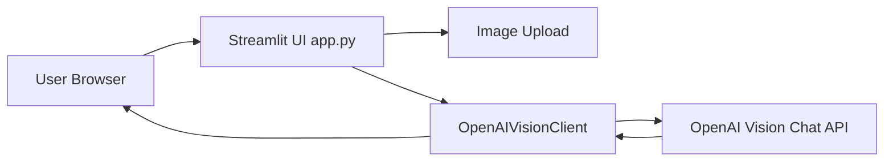

# Nutri‑GPT

An end‑to‑end GenAI application that uses image + text inputs via the OpenAI vision/chat API to identify foods, estimate calories and nutritional content, with a Streamlit‑based web UI.  
Ideal for prototyping visual food recognition, nutrition analytics and AI‑assisted meal logging.

---

## 🚀 Features
- Upload an image of a meal (via `app.py`) → prompt the OpenAI model with a structured “food recognition” request.  
- Parses the model’s response into structured nutrition data (food items, serving sizes, calories, macronutrients).  
- Displays detected items, allows manual corrections of calorie/protein values, and exports results as JSON.  
- Lightweight architecture with modular Python code (client wrapper, image utilities, nutrition lookup, parsing logic).  
- Built with Streamlit for quick UI deployment.

---

## 🧱 Project Structure

```
nutri‑gpt/
├─ README.md
├─ requirements.txt
├─ app.py                ← Streamlit user interface
├─ pyproject.toml        ← project metadata (if using Poetry/Flit)
├─ calorie_scout/        ← main package
│    ├─ __init__.py
│    ├─ config.py        ← loads environment (API key, model defaults)
│    ├─ image_utils.py   ← image loading/encoding utilities
│    ├─ openai_client.py ← wrapper for OpenAI vision/chat calls
└─ tests/                ← (optional) unit tests for parsing logic
```

---

## 🛠️ Setup & Usage

### 1. Install dependencies  
```bash
pip install -r requirements.txt
```

### 2. Set your OpenAI API key  
- Either export as environment variable:  
  ```bash
  export OPENAI_API_KEY="your-key-here"
  ```  
- Or enter it within the Streamlit sidebar when running the app.

### 3. Run the Streamlit app  
```bash
streamlit run app.py
```

### 4. Upload a food image → view detections → edit values → export JSON  
The UI guides you through uploading a picture, sending the prompt, viewing the model output.
---

## 📐 How it Works (Architecture)

1. The user uploads an image via the Streamlit UI.  
2. `openai_client.OpenAIVisionClient` encodes the image (base64) and sends a prompt to the OpenAI model with “food recognition” instructions.  
3. The response generated from the LLM will be given back to the streamlit app to display in the webui. 
4. The UI displays Typical Ingredients, Nutritional Profile, Advantages and Disadvantages.




---

## 🧩 Extending or Customizing

Here are some ideas for enhancing the project:

- **Kiosk or mobile UI variant** – Deploy the UI as a mobile‑friendly web page or convert to a PWA.  
- **Prompt tuning** – Refine the model instructions (prompts) to improve detection accuracy and format consistency.  
- **Caching and rate‑limiting** – Add local caching of model responses or lookup results to reduce cost and latency.

---

## ✅ License & Contribution  
Feel free to fork this repository, send pull requests, and adapt the code for your use case. This project is released under the MIT License unless otherwise specified.  

---

## 📬 Contact  
If you have questions or suggestions, feel free to open an Issue or drop a message via GitHub.

Thanks for checking out Nutri‑GPT — I hope you have fun prototyping smart food‑nutrition applications! 🍴  